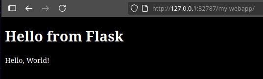

# wsgi-to-zpm
## Generate InterSystems ZPM/IPM module.xml from an existing WSGI project.

`wsgi-to-zpm` was created to help quickly create (or modify) an InterSystems [ZPM/IPM](https://github.com/intersystems/ipm/wiki) module.xml for an existing Python WSGI web application.  This allows you to easily publish/distribute WSGI apps to InterSystems IRIS instances using zpm.

### InterSystems Developer Tools Contest 2025
`wsgi-to-zpm` was originally created/published for the [InterSystems Developer Tools Contest 2025](https://community.intersystems.com/post/intersystems-developer-tools-contest-2025).

## Description

[ZPM/IPM](https://github.com/intersystems/ipm/wiki) makes it very easy to install and configure various software and packages for InterSystems IRIS instances.  The `module.xml`  file is used to configure a ZPM package for distribution (See the [ZPM Wiki](https://github.com/intersystems/ipm/wiki/03.-IPM-Manifest-(module.xml))).  `wsgi-to-zpm` can be used to either quickly generate a `module.xml` or modify an existing `module.xml` to include any Python WSGI web applications it finds in your current directory.

## Prerequisites
- IRIS 2024.1+ (for WSGI Web Application support)
- Python 3 installed on the system

## Installation

Install via pipx:
```bash
pipx install wsgi-to-zpm
```
## Usage

Assume you have a directory with the following Flask app:

```
/home/user/Projects/my-wsgi-app
├── my-webapp/
│   ├── myapp.py
│   ├── templates/
│   │   ├── hello.html
│   └── static/
│       └── style.css
└── requirements.txt
```

To generate a `module.xml`, run `wsgi-to-zpm`:


Depending on your responses, something like the following lines will be added to a `module.xml`:

```xml
<Export generator="Cache" version="25">
  <Document name="my-webapp.ZPM">
    <Module>
    ...
      <FileCopy Name="my-webapp/" Target="${cspDir}my-webapp"/>

      <WebApplication Url="/my-webapp"
        AutheEnabled="32"
        Description=""
        MatchRoles=":${globalsDbRole}"
        NameSpace="${ns}"
        WSGIAppLocation="${cspDir}my-webapp"
        WSGIAppName="myapp"
        WSGICallable="app"
        DispatchClass="%SYS.Python.WSGI"/>
    ...
    </Module>
  </Document>
</Export>
```

## Installing Your WSGI App Via ZPM

Now that you have a `module.xml`, you are able to load this WSGI app as a zpm package.


```cls
irisowner@bea89444b155:~/dev$ iris terminal IRIS

Node: bea89444b155, Instance: IRIS

USER>zn "IRISAPP"

IRISAPP>zpm

=============================================================================
|| Welcome to the Package Manager Shell (ZPM). Version:                    ||
|| Enter q/quit to exit the shell. Enter ?/help to view available commands ||
|| Current registry https://pm.community.intersystems.com                  ||
=============================================================================
zpm:IRISAPP>load /home/user/Projects/my-wsgi-app

[IRISAPP|my-webapp]	Reload START (/home/user/Projects/my-wsgi-app/)
[IRISAPP|my-webapp]	requirements.txt START
[IRISAPP|my-webapp]	requirements.txt SUCCESS
[IRISAPP|my-webapp]	Reload SUCCESS
[my-webapp]	Module object refreshed.
[IRISAPP|my-webapp]	Validate START
[IRISAPP|my-webapp]	Validate SUCCESS
[IRISAPP|my-webapp]	Compile START
[IRISAPP|my-webapp]	Compile SUCCESS
[IRISAPP|my-webapp]	Activate START
[IRISAPP|my-webapp]	Configure START
[IRISAPP|my-webapp]	Configure SUCCESS
[IRISAPP|my-webapp]	Activate SUCCESS
zpm:IRISAPP>
```

Your WSGI app should now show up in `System Administration > Security > Applications > Web Applications`, and should be served at the URL you provided while running `wsgi-to-zpm`.

### Docker Demo
If you would like to try out this process from a Docker image, follow these steps:

```bash
$ git clone git@github.com:jamerfort/wsgi-to-zpm-demo.git
$ cd wsgi-to-zpm-demo
$ docker compose up -d
```
Once the Docker container is up and running, connect to it via bash:

```bash
# Connect to the Docker container to run ZPM
$ docker exec -it wsgi-to-zpm-demo-iris-1 bash
```
Once inside the container, go to `./my-wsgi-app/` and run `wsgi-to-zpm`:

```bash
irisowner@4a28b76363cb:/opt/irisapp$ cd my-wsgi-app/

irisowner@4a28b76363cb:/opt/irisapp/my-wsgi-app$ wsgi-to-zpm 

Creating module.xml
Add to module.xml? my-webapp/myapp.py         [Yn] : y
Is this your WSGI callable? app               [Yn] : y
Would you like to update the project name to "my-webapp"? [Yn] : y

Choose a local path to include in the module

    1. .
    2. my-webapp
    3. my-webapp/myapp.py

Enter a choice                                     : 2

Choose a URL for your WSGI app

    1. /my-webapp
    2. /my-webapp/my-webapp

Enter a choice                                     : 1
Choose a base directory to install this WSGI app in

    1. ${libDir}
    2. ${mgrDir}
    3. ${cspDir}

Enter a choice                                     : 3

Saving module.xml
irisowner@4a28b76363cb:/opt/irisapp/my-wsgi-app$ 
```

A new `module.xml` has been created, allowing this directory to be installed as a ZPM package:

```bash
irisowner@4a28b76363cb:/opt/irisapp/my-wsgi-app$ ls -ltr

total 12
-rw-rw-r-- 1 irisowner irisowner    6 Jul 29 05:47 requirements.txt
drwxrwxr-x 4 irisowner irisowner 4096 Jul 29 05:47 my-webapp
-rw-r--r-- 1 irisowner irisowner  911 Jul 29 05:51 module.xml
```

Start ZPM from an IRIS terminal, and load this WSGI app as a zpm package.


```cls
irisowner@4a28b76363cb:/opt/irisapp/my-wsgi-app$ iris terminal IRIS

Node: 4a28b76363cb, Instance: IRIS

USER>zn "IRISAPP"

IRISAPP>zpm

=============================================================================
|| Welcome to the Package Manager Shell (ZPM). Version:                    ||
|| Enter q/quit to exit the shell. Enter ?/help to view available commands ||
|| Current registry https://pm.community.intersystems.com                  ||
=============================================================================
zpm:IRISAPP>load /opt/irisapp/my-wsgi-app

[IRISAPP|my-webapp]	Reload START (/opt/irisapp/my-wsgi-app/)
[IRISAPP|my-webapp]	requirements.txt START
[IRISAPP|my-webapp]	requirements.txt SUCCESS
[IRISAPP|my-webapp]	Reload SUCCESS
[my-webapp]	Module object refreshed.
[IRISAPP|my-webapp]	Validate START
[IRISAPP|my-webapp]	Validate SUCCESS
[IRISAPP|my-webapp]	Compile START
[IRISAPP|my-webapp]	Compile SUCCESS
[IRISAPP|my-webapp]	Activate START
[IRISAPP|my-webapp]	Configure START
[IRISAPP|my-webapp]	Configure SUCCESS
[IRISAPP|my-webapp]	Activate SUCCESS
zpm:IRISAPP>
```

Visiting the URL **http://[host]:[port]/my-webapp/** will now serve your WSGI app (use SuperUser with "SYS" password for this demo):


